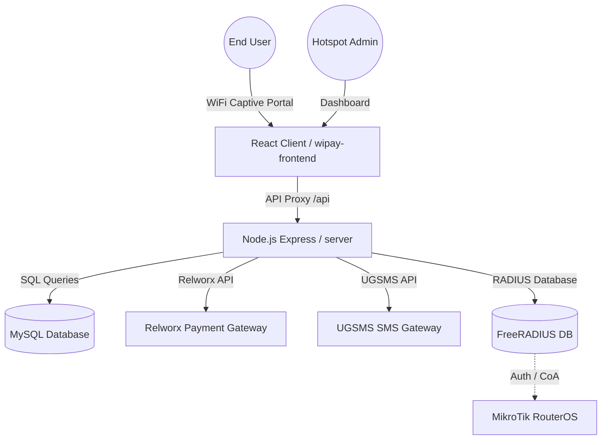
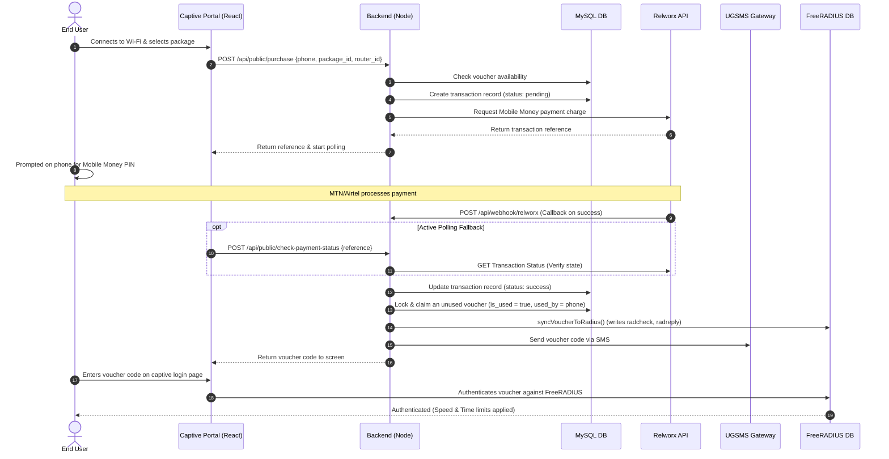
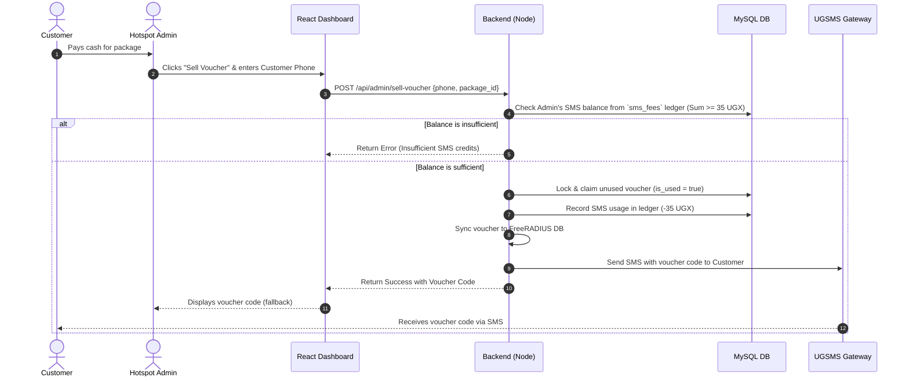
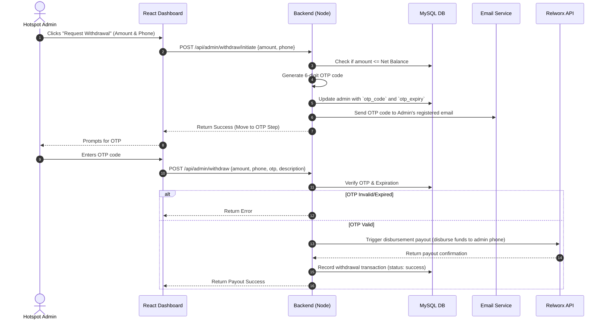

# UGPAY / WiPay Onboarding & User Journeys Master Guide

Welcome to the **UGPAY / WiPay** development team! This guide is designed to bring you up to speed with how the system works, the end-to-end user journeys, and the technical mechanics behind the scenes.

---

## 1. High-Level Architecture

UGPAY is a **Multi-Tenant Wi-Fi Billing and Management System** designed for ISPs and Hotspot owners in Uganda. It allows admins (tenants) to manage multiple MikroTik hotspots, define billing packages, sell vouchers (manually or automatically via mobile money), and track financial analytics.



### 1.1 Core Components
1. **Frontend (`wipay-frontend/`)**: A React + Vite SPA. It serves both the **Public Captive Portal** (where end-users purchase Internet) and the **Admin Dashboard** (where hotspot owners manage their routers, vouchers, packages, and withdrawals).
2. **Backend (`server/`)**: A Node.js Express server. It handles business logic, security middleware, database queries, and third-party integrations (Relworx for Mobile Money, UGSMS for SMS notifications).
3. **Database (MySQL)**: Holds application tables (`admins`, `routers`, `vouchers`, etc.) and the standard **FreeRADIUS schema** (`radcheck`, `radreply`, `radusergroup`, etc.) for managing active network authentication.

---

## 2. Core Database Schema

Understanding these key tables and their relationships is crucial:

| Table | Purpose | Important Fields |
| :--- | :--- | :--- |
| `admins` | Multi-tenant hotspot owners / administrators. | `username`, `email`, `password_hash`, `role` (admin/super_admin), `business_name`, `subscription_expiry` |
| `routers` | Physical MikroTik hotspot instances owned by admins. | `id`, `admin_id`, `name`, `ip_address`, `dns_name`, `secret` |
| `packages` | Internet plans defined by admins. | `id`, `admin_id`, `name`, `price`, `validity_hours`, `rate_limit` (e.g., "1M/2M"), `simultaneous_devices` |
| `vouchers` | Single-use access codes mapped to packages. | `id`, `admin_id`, `package_id`, `code`, `is_used` (boolean), `used_by` (phone number), `used_at` |
| `transactions` | Log of all Mobile Money payments. | `id`, `router_id`, `amount`, `phone_number`, `reference`, `status` (pending/success/failed), `type` (sms_topup/voucher_purchase) |
| `sms_fees` | Ledger records for Admin SMS balances. | `id`, `admin_id`, `amount` (+ve for top-ups, -35 UGX for usage), `type` (topup/usage), `status` |
| `radcheck` | FreeRADIUS credentials validation. | `username` (voucher code), `attribute` ('Cleartext-Password'), `op` (':='), `value` (voucher code) |
| `radreply` | FreeRADIUS attributes returned to NAS. | `username` (voucher code), `attribute` ('Mikrotik-Rate-Limit' / 'Session-Timeout'), `value` |
| `radusergroup` | Maps RADIUS users to groups. | `username` (voucher code), `groupname` (e.g., `pkg_10`) |

---

## 3. End-to-End User Journeys

### Journey A: Customer Self-Service Wi-Fi Purchase

This is the primary user journey when an end-user wants to buy Internet access.



> [!NOTE]
> **Active Polling Fallback:** In local environments (or if the webhook server drops the packet), the client actively polls `/api/public/check-payment-status`. The backend queries Relworx directly to ensure the customer receives their voucher even if the webhook callback fails.

---

### Journey B: Over-the-Counter Cash Sales (Admin-Initiated)

For walk-in customers who prefer paying in Cash directly to the hotspot owner.



---

### Journey C: Admin SMS Wallet Top-up

Each SMS sent costs **35 UGX**. Admins must top up their SMS wallet using Mobile Money to continue selling vouchers manually or sending credentials.

1. **Dashboard Entry:** Admin enters their phone number and amount (e.g., 5,000 UGX) inside the "Buy SMS" modal.
2. **Initiate Payment:** React client makes `POST /api/admin/buy-sms`. The backend contacts Relworx to trigger a payment request.
3. **Background Polling:** The admin can minimize the payment modal and continue working. The frontend polls `/api/admin/sms-status/:ref` in the background.
4. **Completion:** When the payment succeeds, the backend inserts a positive credit record (e.g., `+5000`) into the `sms_fees` table. The ledger balance dynamically updates on the dashboard layout.

---

### Journey D: Revenue Withdrawal (Admin Payout)

When admins collect money from online self-service sales, it accumulates in their `Net Balance` (Total Revenue - Total Withdrawn). They can withdraw this money to their mobile money account.



---

## 4. Under-the-Hood Mechanics

### 4.1 FreeRADIUS DB Synchronization
FreeRADIUS controls network authorization by checking the MySQL database. When a voucher is successfully issued, the backend updates the RADIUS tables:
* **Authentication**: Inserts username/password into `radcheck`.
  ```sql
  INSERT INTO radcheck (username, attribute, op, value) 
  VALUES ('VOUCHER_CODE', 'Cleartext-Password', ':=', 'VOUCHER_CODE');
  ```
* **Bandwidth Control (MikroTik Rate Limiting)**: Inserts rate limits into `radreply` in the format `Upload/Download` (e.g., `1M/2M` or `512k/1M`).
  ```sql
  INSERT INTO radreply (username, attribute, op, value) 
  VALUES ('VOUCHER_CODE', 'Mikrotik-Rate-Limit', '=', '1M/2M');
  ```
* **Time Expiration (Session-Timeout)**: Sets the maximum duration the session can last, in seconds (validity hours × 3600).
  ```sql
  INSERT INTO radreply (username, attribute, op, value) 
  VALUES ('VOUCHER_CODE', 'Session-Timeout', ':=', '3600');
  ```
* **Simultaneous Device Limits**: If a package allows multiple devices (e.g. 2 phones), it adds `Simultaneous-Use` to `radcheck`.
  ```sql
  INSERT INTO radcheck (username, attribute, op, value)
  VALUES ('VOUCHER_CODE', 'Simultaneous-Use', ':=', '2');
  ```

### 4.2 Force-Disconnect Active Sessions (RADIUS CoA)
When an admin deletes or suspends a voucher/user, the system terminates any active Wi-Fi session instantly using **Change of Authorization (CoA)**:
1. Queries the `radacct` table to find active sessions for the user:
   ```sql
   SELECT nasipaddress FROM radacct WHERE username = ? AND acctstoptime IS NULL LIMIT 1;
   ```
2. Resolves the Shared Secret of the NAS (Network Access Server / MikroTik router) from the `nas` table.
3. Executes a shell command to send a Packet of Disconnect (PoD):
   ```bash
   echo "User-Name = VOUCHER_CODE" | radclient -x NAS_IP:3799 disconnect SHARED_SECRET
   ```

---

## 5. Getting Started as a Developer

### 5.1 Local Setup Checklist
1. **Node.js**: Verify you have Node.js 16+ (`node -v`).
2. **Database**: Start MySQL server. Ensure the database `wipay` is created.
3. **Database Initial Setup**: Run the multitenancy setup script to populate core schema:
   ```bash
   node server/scripts/setup_multitenancy.js
   ```
4. **Create Admin User**: Create your first admin account to log in:
   ```bash
   node server/scripts/create_admin.js <username> <password> <email>
   ```

### 5.2 Running the Project
Use the convenience PowerShell startup script from the root folder:
```powershell
.\start-dev.ps1
```
* This runs the React dev server on `http://localhost:5173`.
* It starts the Node backend API on `http://localhost:5002` (proxied by Vite config).
* Point your browser to `http://localhost:5173/login` to log into the Admin Dashboard.

### 5.3 Simulating Payments Locally
Since you won't trigger real mobile money prompt requests locally, you can simulate Relworx webhook callbacks:
* Send a POST request to `http://localhost:5002/api/webhook` with the payload format of the Relworx API transaction confirmation to test successful purchases and SMS top-ups.
